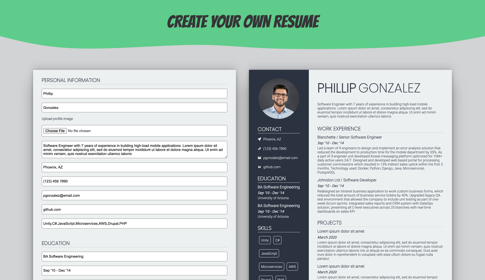

# CV Builder

A React web application to create your own CV / resume.
Live Demo -> [https://tynasello.github.io/cv-builder](https://tynasello.github.io/cv-builder)

## Overview



### How to use

To use this application fill out the form on the left hand side of the page with personal values such as your name, profile picture, work experience, etc. The CV on the right hand side of the page will synchronously update as you type.

Close to the bottom of the form you can find two buttons labeled 'Display Empty CV' and 'Display Example CV' which clear the CV and display an example CV, respectively.

Main sections of the CV include a personal description, contact section, education section, skills education, work experience section, and projects section.

To add and remove subsections of a section, press the green 'add' and red 'remove' buttons respectively.

When adding to the skills section, seperate each infividual skills by a comma like so: Unity,C#,JavaScript. This ensures the addition of the skill element styling to each skill.

### Exporting CV as PDF

To save your own CV as a PDF, use the 'Export as PDF' button near the bottom of the form. The react-to-print package was leveraged to allow the exportation of the CV component to PDF.

### Choosing CV Colors

There are three color pickers at the bottom of the CV form which allow you to change the CV's sidebar background color, sidebar font color, and main font color. The color pickers are BlockPicker components from the react-color package.

## Installation

To Work on this project:

Clone project:

```bash
git clone https://github.com/Tynasello/cv-builder
```

Change into project directory:

```bash
cd cv-builder
```

Install required dependencies:

```bash
npm install
```

To run the app in the development mode:

```bash
npm run start
```

Open [http://localhost:3000](http://localhost:3000) to view it in the browser.

To build the app for production to the build folder:

```bash
npm run build
```

## Built With

- [ReactJS](https://reactjs.org/)
- [styled-components](https://styled-components.com/)
- [react-color](https://casesandberg.github.io/react-color/)
- [react-to-print](https://www.npmjs.com/package/react-to-print)
- [uuid](https://www.npmjs.com/package/uuid)
- [react-icons](https://react-icons.github.io/react-icons/)

## Acknowledgments

Inspiration for this project was found while following the tutorials on https://www.theodinproject.com/dashboard and advancing to the https://www.theodinproject.com/paths/full-stack-javascript/courses/javascript/lessons/cv-application section
